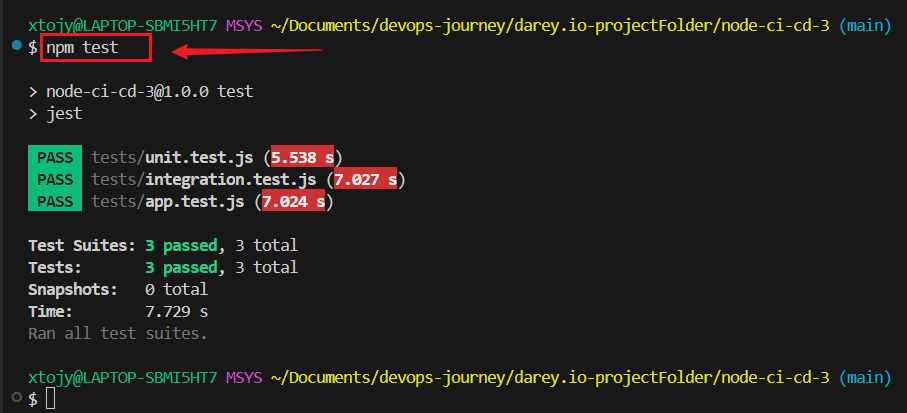

# 🚀 Node.js CI/CD Pipeline with GitHub Actions & AWS EC2  

## 📌 Project Overview  
This project demonstrates a **Continuous Integration and Continuous Deployment (CI/CD) pipeline** using **GitHub Actions** to automatically test, build, and deploy a Node.js application to an AWS EC2 instance.  

## Objective
+ Implement matrix builds to test across multiple versions/environments.
+ Optimize build dependencies with caching.
+ Integrate code quality checks (linting, static analysis).

## 📑 Table of Contents  
- [📌 Project Overview](#-project-overview)  
- [📦 Tech Stack](#-tech-stack)  
- [⚙️ Setup Instructions](#️-setup-instructions)  
- [🛠 GitHub Actions Workflow](#-github-actions-workflow)  
- [📡 Deployment](#-deployment)  
- [🧪 Running Tests](#-running-tests)  
- [📝 Linting and Code Quality](#-linting-and-code-quality)  
- [🚀 Future Improvements](#-future-improvements)  
- [🙌 Contributing](#-contributing)  

## 📦 Tech Stack  
- **Node.js** - Backend runtime  
- **Express.js** - Web framework  
- **Jest** - Testing framework  
- **ESLint** - Code quality checker  
- **PM2** - Process manager for Node.js  
- **GitHub Actions** - CI/CD automation  
- **AWS EC2** - Cloud hosting  

---

## ⚙️ Setup Instructions  
+ **Create and Initialize The Repository**
```
mkdir node-ci-cd-3
cd node-ci-cd-3
git remote add origin <repository-URL>
git push -u origin main
```


## Install Dependencies
```
npm install
```

## Set Up Environment Variables
Create a .env file in the project root:

```
PORT=3000
DATABASE_URL=mongodb://localhost:27017/mydatabase
```

**Run the Application Locally**
```
npm start
```
Visit: http://localhost:3000


## 🛠 GitHub Actions Workflow

### 📌 Features of CI/CD Pipeline:
✅ Matrix Builds: Tests on Node.js 16.x, 18.x, 20.x

✅ Automatic Linting: Runs ESLint on all commits

✅ Automated Testing: Executes unit tests before deployment

✅ Caching: Optimized dependency management

✅ EC2 Deployment: Deploys only if all checks pass


## 🛠 Step 1: Modify GitHub Actions Workflow to Support Matrix Builds
Matrix builds allow you to run your CI/CD pipeline across multiple Node.js versions in parallel.

## 📜 GitHub Actions Workflow (.github/workflows/deploy.yml)
```
name: Deploy to AWS EC2

on:
  push:
    branches:
      - main

jobs:
  build-and-test:
    runs-on: ubuntu-latest
    strategy:
      matrix:
        node-version: [16.x, 18.x, 20.x] # Test across multiple Node.js versions

    steps:
    - name: Checkout Repository
      uses: actions/checkout@v4

    - name: Set up Node.js ${{ matrix.node-version }}
      uses: actions/setup-node@v4
      with:
        node-version: ${{ matrix.node-version }}
        cache: 'npm' # Enables caching for dependencies

    - name: Install Dependencies
      run: npm ci

    - name: Run Tests
      run: npm test

  deploy:
    needs: build-and-test # Ensures deployment only happens if tests pass
    runs-on: ubuntu-latest

    steps:
    - name: Set up SSH Key
      run: |
        mkdir -p ~/.ssh
        echo "${{ secrets.EC2_SSH_KEY }}" > ~/.ssh/ci-cd-key
        chmod 600 ~/.ssh/ci-cd-key
        ssh-keyscan <your-ec2-public-ip> >> ~/.ssh/known_hosts

    - name: Deploy to AWS EC2
      uses: appleboy/ssh-action@master
      with:
        host: ${{ secrets.EC2_HOST }}
        username: ubuntu
        key: ${{ secrets.EC2_SSH_KEY }}
        script: |
          cd ~/node-ci-cd-3 || git clone https://github.com/Joy-it-code/node-ci-cd-3.git ~/node-ci-cd-3
          cd ~/node-ci-cd-3
          git pull origin main
          npm install
          pm2 restart index.js || pm2 start index.js --name "node-app"
```

## 📦 Step 2: Optimize Build Dependencies Using Caching

+ This helps to speeds up installation by caching node_modules.
+ If package-lock.json doesn’t change, it restores from cache

## 🔹 2.1 Enable Dependency Caching

**Modify the Node.js setup step in deploy.yml to use caching:**

```
- name: Cache Node Modules
  uses: actions/cache@v2
  with:
    path: ~/.npm
    key: ${{ runner.os }}-node-${{ hashFiles('**/package-lock.json') }}
    restore-keys: |
      ${{ runner.os }}-node-
```

## 🧹 Step 3: Integrate Code Quality Checks (Linting, Static Analysis)
**🔹 3.1 Install ESLint Locally**
Run the following in your project directory:
```
npm install --save-dev eslint
```

**🔹 3.2 Initialize ESLint**
```
npx eslint --init
```

## Check if ESLint is working and Version
```
npx eslint --version
npx eslint . --ext .js
```

## 📄 Step 4: Add Linting Step in GitHub Actions
**Modify deploy.yml:**
```
    - name: Run Linter
      run: npx eslint .
```

To auto-fix issues locally before committing:
```
npx eslint . --fix
```

## 📝 Step 5: Update jest section in package.json
**Modify package.json**
```
},
  "devDependencies": {
    "@babel/core": "^7.26.10",
    "@babel/preset-env": "^7.26.9",
    "@eslint/js": "^9.22.0",
    "babel-jest": "^29.7.0",
    "cross-env": "^7.0.3",
    "eslint": "^8.57.1",
    "globals": "^16.0.0",
    "jest": "^29.7.0",
    "supertest": "^7.0.0"
  },
  "jest": {
    "transform": {
      "^.+\\.js$": "babel-jest"
    },
    "testEnvironment": "node"
  }
}
```

## 🔬 Step 6: Test Everything Locally Before Pushing
🔹 6.1 Run Linter
```
npx eslint .
```

**Fix errors if needed:**

```
npx eslint . --fix
```
**To Verify:**
```
npx eslint .
```
**Install dotenv:**
```
npm install dotenv

```
🔹 6.2 Run Tests
```
npm test
npm start
```



🔹On Browser:
```
http://localhost:3000/
```
🔹 6.3 Check Build
```
npm run build
```

**Updated GitHub Actions Workflow (CI)
```
name: Node.js CI/CD Pipeline

on:
  push:
    branches:
      - main
  pull_request:
    branches:
      - main

jobs:
  build:
    runs-on: ubuntu-latest

    strategy:
      matrix:
        node-version: [16.x, 18.x, 20.x]

    steps:
      - name: Checkout repository
        uses: actions/checkout@v2

      - name: Set up Node.js ${{ matrix.node-version }}
        uses: actions/setup-node@v2
        with:
          node-version: ${{ matrix.node-version }}
      
      # Caching node_modules to speed up the workflow
      - name: Cache node modules
        uses: actions/cache@v2
        with:
          path: ~/.npm
          key: ${{ runner.os }}-node-${{ matrix.node-version }}-node_modules-${{ hashFiles('**/package-lock.json') }}
          restore-keys: |
            ${{ runner.os }}-node-${{ matrix.node-version }}-node_modules-

      - name: Install dependencies
        run: npm ci

      # Optional: Run linting before tests (for code quality checks)
      - name: Run ESLint
        run: npm run lint

      - name: Run tests
        run: npm test
```

🔹 6.4 Push Changes
```
git add .
git commit -m "Added matrix builds and linting"
git push origin main
```

## ✅ Final Check

+ Go to GitHub → Actions and verify:

✅ Linting runs successfully

✅ Tests pass on all Node.js versions

✅ Deployment happens only if tests pass


**Check your AWS EC2 app on your Terminal:**
```
curl http://<your-ec2-public-ip>:3000/
```
🎉 If you see "Hello World!", your pipeline is working perfectly!


## Conclusion
This project automates CI/CD for Node.js apps with GitHub Actions and AWS EC2, ensuring reliable and efficient delivery.

**📌 Author: Joy Nwatuzor**

**🎉 Happy Coding! 🚀**


